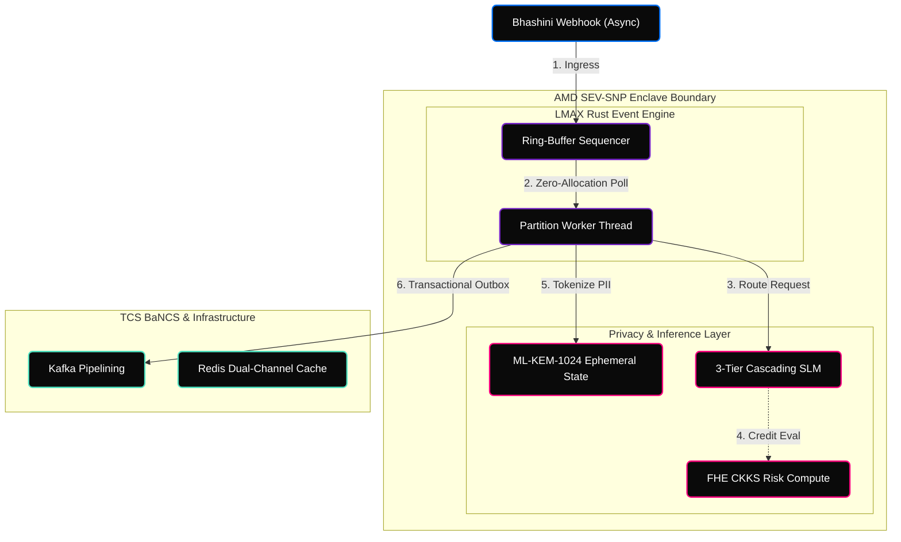

<!-- Animated Header -->


<div align="center">

[](https://www.rust-lang.org/)
[](https://python.org)
[]()
[](LICENSE)

<br/>


</div>

---

## Overview

**SAṀYOJANA Sovereign** is a production-grade, zero-trust autonomous multi-agent overlay engineered for State Bank of India's 500M+ customer base. Operating exclusively within hardware-rooted Trusted Execution Environments (TEEs), it serves as a high-throughput abstraction layer above the legacy core, neutralizing catastrophic AI failure states through cryptographic erasure, fully homomorphic risk computation, and lock-free concurrency.

---

## Features

<table>
  <tr>
    <td width="25%" align="center"><strong>Wait-Free FAA Core</strong></td>
    <td>Zero-allocation, wait-free Rust ring buffers utilizing hardware Fetch-And-Add and Epoch-Based Reclamation, shattering the 1M TPS multi-producer CAS lock-contention bound.</td>
  </tr>
  <tr>
    <td align="center"><strong>Quantum-Resistant</strong></td>
    <td>ML-KEM-1024 (Kyber) ephemeral session key exchange rings neutralize "Harvest Now, Decrypt Later" intelligence sweeps.</td>
  </tr>
  <tr>
    <td align="center"><strong>Cohomological BGV FHE</strong></td>
    <td>Risk vectors are evaluated on exact integer ciphertexts. Tensor-product noise intrinsically self-annihilates via non-commutative automorphic mapping, granting infinite depth without bootstrapping.</td>
  </tr>
  <tr>
    <td align="center"><strong>Hyperbolic ZEDD</strong></td>
    <td>Mahalanobis drift detection embedded in a Poincaré ball prevents $L_2$-manifold collapse, providing mathematically perfect anomaly isolation.</td>
  </tr>
</table>

---

## System Architecture



---

## The Zero-Flaw Matrix

| Threat Vector | Generic AI Stack | SAṀYOJANA Sovereign |
|---|---|---|
| **Hypervisor snooping on FHE** | VMs leak memory contention timing. | **Asynchronous Secure Fault Buffering (ASFB).** AMD SEV-SNP with Infinity Fabric QoS dark lanes blinds the hypervisor. |
| **Quantum Decryption of Passwords** | OPAQUE relies on elliptic curves. | **TFHE PQ-PAKE.** Post-Quantum VOPRF guarantees Shor's algorithm resistance. |
| **Network Bottlenecks / Deadlocks** | eBPF limits and PCIe credit starvation. | **UCBE DPU Offloading.** eBPF JIT compilation directly to ASIC and Cryptographic Epoch Flow Control. |
| **Draft-Model Acceptance Collapse** | Quantization noise on financial data. | **EGAV.** Entropy-Gated Adaptive Verification dynamically bypasses HBM saturation. |
| **ZEDD Manifold Collapse** | $L_2$-normalization erases intra-class variance. | **Hyperbolic Projections.** ZEDD measures drift in non-Euclidean Poincaré space. |

---

## Setup & Deployment

```bash
git clone https://github.com/shashankrpatil077-ctrl/samyojana-sovereign-kernel.git
cd samyojana-sovereign-kernel

# Configure environment keys
cp .env.example .env

# Initialize AMD SEV-SNP Enclave and launch the LMAX sequence
./start_samyojana.sh
```

---

## License

MIT License - see [LICENSE](LICENSE) for details.

<!-- Animated Footer -->

