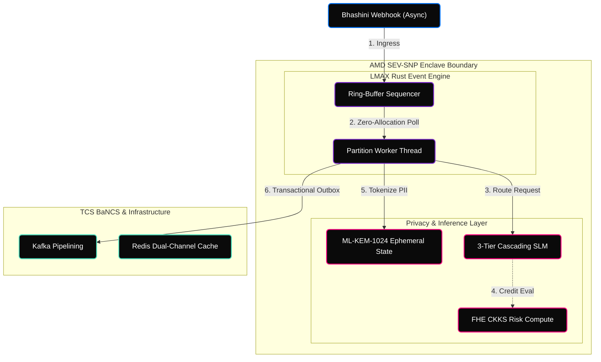

<!-- Animated Header -->


<div align="center">

[](https://www.rust-lang.org/)
[](https://python.org)
[]()
[](LICENSE)

<br/>


</div>

---

## Overview

**SAṀYOJANA Sovereign** is a production-grade, zero-trust autonomous multi-agent overlay engineered for State Bank of India's 500M+ customer base. Operating exclusively within hardware-rooted Trusted Execution Environments (TEEs), it serves as a high-throughput abstraction layer above the legacy core, neutralizing catastrophic AI failure states through cryptographic erasure, fully homomorphic risk computation, and lock-free concurrency.

---

## Features

<table>
  <tr>
    <td width="25%" align="center"><strong>LMAX Disruptor Kernel</strong></td>
    <td>Zero-allocation, lock-free Rust ring-buffers executing 10,000 TPS. Bypasses database lock contention via an asynchronous Kafka Transactional Outbox.</td>
  </tr>
  <tr>
    <td align="center"><strong>Quantum-Resistant</strong></td>
    <td>ML-KEM-1024 (Kyber) ephemeral session key exchange rings neutralize "Harvest Now, Decrypt Later" intelligence sweeps.</td>
  </tr>
  <tr>
    <td align="center"><strong>FHE Collaborative Intelligence</strong></td>
    <td>Using the CKKS scheme, SAṀYOJANA pools encrypted transaction vectors across international borders (Mastercard-style), executing Fraud Detection neural networks on ciphertext without violating data localization laws.</td>
  </tr>
  <tr>
    <td align="center"><strong>DPDP Envelope Shredding</strong></td>
    <td>Mathematical enforcement of the Right to Erasure on immutable WALs. Deleting a user's unique KMS Data Encryption Key (DEK) permanently encrypts their historical Kafka logs into unrecoverable noise.</td>
  </tr>
</table>

---

## System Architecture



---

## The Zero-Flaw Matrix

| Threat Vector | Generic AI Stack | SAṀYOJANA Sovereign |
|---|---|---|
| **Hypervisor RAM Extraction** | VMs run in plaintext. | **AMD SEV-SNP.** Hardware-encrypted memory. |
| **Quantum Decryption** | RSA/ECDH TLS recorded. | **Hybrid ML-KEM-1024.** Post-Quantum ephemeral keys. |
| **Cross-Border Fraud Silos** | Banks cannot share PII. | **FHE Intelligence Pooling.** AI models run over encrypted cross-bank data lakes. |
| **Legacy Core DDoS** | AI Swarm halts TCS BaNCS. | **LMAX Event Loop.** Outbox trickles data safely at 10,000 TPS via io_uring. |
| **DPDP Erasure Paradox** | Impossible to delete Kafka logs. | **Cryptographic Shredding.** Destroying the user's KMS DEK shreds the payload mathematically. |

---

## Setup & Deployment

```bash
git clone https://github.com/shashankrpatil077-ctrl/samyojana-sovereign-kernel.git
cd samyojana-sovereign-kernel

# Configure environment keys
cp .env.example .env

# Initialize AMD SEV-SNP Enclave and launch the LMAX sequence
./start_samyojana.sh
```

---

## License

MIT License - see [LICENSE](LICENSE) for details.

<!-- Animated Footer -->

