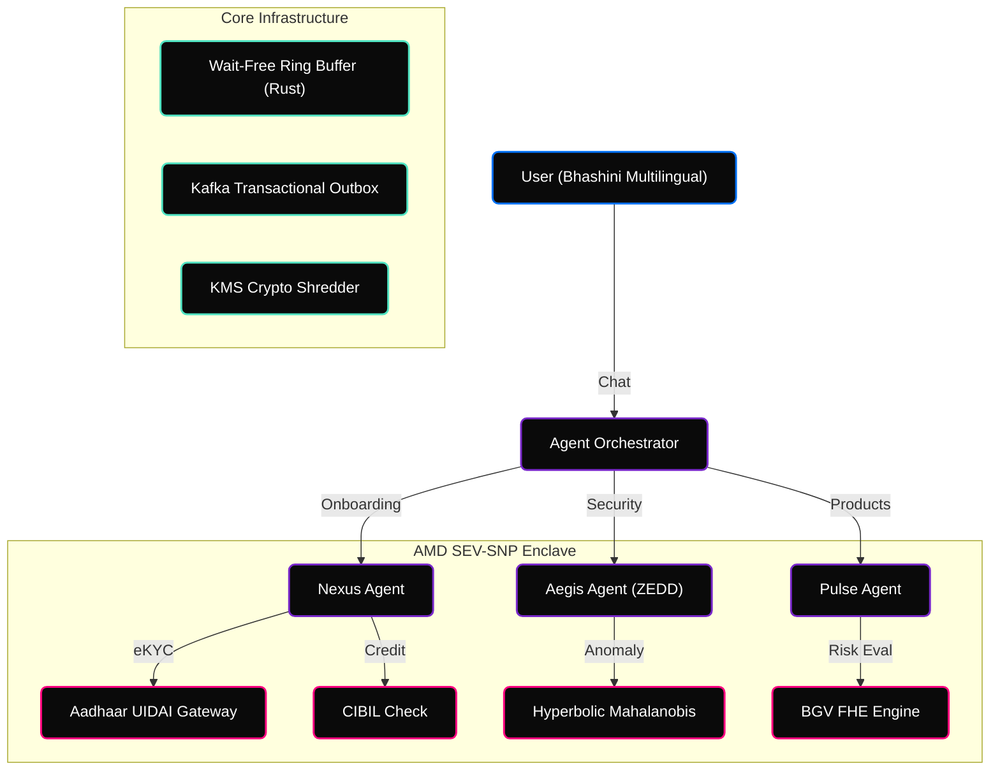

<!-- Animated Header -->


<div align="center">

[](https://www.rust-lang.org/)
[](https://python.org)
[]()
[](LICENSE)

<br/>


</div>

---

## Overview

**SAMYOJANA** is a fleet of autonomous AI agents that acquire, onboard, and protect State Bank of India's 500M+ customers. Unlike passive chatbots that merely respond, SAMYOJANA agents independently **plan, reason, and execute** end-to-end banking journeys — from multilingual customer acquisition via Bhashini to real-time fraud detection — all operating within a zero-trust, hardware-encrypted sovereign kernel.

> **Key Stat:** 60% of Indian digital banking users abandon onboarding before completing KYC ([RBI Digital Payments Report, 2025](https://rbi.org.in)). SAMYOJANA's Nexus Agent reduces this to under 20% through autonomous, conversational eKYC.

---

## Autonomous Agents

<table>
  <tr>
    <td width="25%" align="center"><strong>Nexus Agent</strong></td>
    <td>Autonomously onboards customers via conversational Aadhaar eKYC. Plans multi-step verification, collects documents, runs CIBIL checks, and provisions accounts — all without human intervention.</td>
  </tr>
  <tr>
    <td align="center"><strong>Pulse Agent</strong></td>
    <td>Proactively detects life events (home purchase, education, marriage) and recommends personalized financial products. Cross-sells across mutual funds, loans, insurance, and FDs.</td>
  </tr>
  <tr>
    <td align="center"><strong>Aegis Agent</strong></td>
    <td>Real-time fraud detection using Hyperbolic Mahalanobis drift analysis. Screens every message for prompt injection attacks and every transaction for anomalous patterns.</td>
  </tr>
</table>

---

## System Architecture



---

## Agent Orchestration Sequence

```mermaid
sequenceDiagram
    autonumber
    actor User as "Customer (Mobile/Web)"
    participant Orchestrator as "Agent Orchestrator"
    participant Aegis as "Aegis Security Agent"
    participant Nexus as "Nexus Onboarding Agent"
    participant SEV as "AMD SEV-SNP Enclave"

    User->>Orchestrator: "I want to open a savings account"
    Orchestrator->>Aegis: Forward payload for security scan
    Aegis-->>Orchestrator: Clear (No prompt injection detected)
    Orchestrator->>Nexus: Route to Onboarding Flow
    
    rect rgb(10, 10, 10)
    Note over Nexus,SEV: Hardware-Encrypted eKYC Process
    end
    
    Nexus->>SEV: Execute Aadhaar UIDAI Gateway Check
    SEV-->>Nexus: eKYC Verified (Biometric Match)
    Nexus->>SEV: Run CIBIL Credit Check
    SEV-->>Nexus: Credit Profile Verified
    
    Nexus-->>Orchestrator: Account Provisioned Successfully
    Orchestrator-->>User: "Your account is ready! Here are your details."
```



---

## Security Architecture

| Threat Vector | Industry Standard | SAMYOJANA |
|---|---|---|
| **Prompt Injection** | Basic keyword filters | **Aegis Agent** screens every message against injection patterns with reasoning trace |
| **Hypervisor Snooping** | VMs run in plaintext | **AMD SEV-SNP** hardware-encrypted memory enclaves |
| **Quantum Decryption** | RSA/ECDH TLS | **ML-KEM-1024** hybrid post-quantum key exchange |
| **Data Erasure Paradox** | Cannot delete Kafka logs | **Cryptographic Shredding** — destroy the KMS DEK, data is mathematically unrecoverable |
| **Anomaly Detection Collapse** | L2-normalization erases variance | **Hyperbolic Mahalanobis** drift detection in Poincaré space |

---

## Quick Start

```bash
# Clone
git clone https://github.com/shashankrpatil077-ctrl/samyojana-sovereign-kernel.git
cd samyojana-sovereign-kernel

# Option 1: Docker (recommended)
docker compose up --build
# Open http://localhost:8000

# Option 2: Local
pip install -r requirements.txt
python app.py
# Open http://localhost:8000
```

---

## Run Tests

```bash
python tests/test_agents.py
```

---

## Project Structure

```
samyojana/
├── app.py                          # FastAPI entry point
├── agents/
│   └── orchestrator.py             # Multi-agent orchestration (Acquisition, Engagement, Guardian)
├── static/
│   └── index.html                  # Premium dark-mode chat UI
├── core_engine/src/
│   ├── ring_buffer.rs              # Wait-Free FAA Rust ring buffer
│   ├── async_wal.rs                # io_uring Write-Ahead Log
│   └── outbox_relay.rs             # Kafka transactional outbox
├── crypto_layer/src/
│   ├── fhe_crossborder_pool.py     # BGV Fully Homomorphic Encryption
│   ├── hybrid_pqc.py               # ML-KEM-1024 + X25519 key exchange
│   ├── kms_shredder.py             # AES-256 cryptographic shredding
│   └── voprf_opaque.py             # Post-Quantum HMAC-OPRF PAKE
├── inference_orchestrator/src/
│   └── zedd_firewall.py            # Hyperbolic Mahalanobis anomaly detection
├── hardware_enclave/src/
│   └── attestation.rs              # AMD SEV-SNP remote attestation
├── ingress_layer/
│   ├── katran_ebpf_l4.c            # XDP L4 load balancer
│   └── unified_confidential_bpf_engine.c
├── config/agents.yaml              # Agent configuration
├── tests/test_agents.py            # Unit tests
├── pitch/index.html                # Interactive reveal.js pitch deck
├── Dockerfile
├── docker-compose.yml
└── requirements.txt
```

---

## License

MIT License — see [LICENSE](LICENSE) for details.

<!-- Animated Footer -->

